# Keyboard-remap-realtime-Lite
Keyboard remap realtime Lite senior
https://latincompass.github.io/Keyboard-remap-realtime-Lite/
Online:
https://www.bilibili.com/video/BV1zYoNBsEDb/?vd_source=7b29c1bfbe5a4ff7e0d82bd990d9b02a
Local:
https://www.bilibili.com/video/BV1ypoNBwEJF/?vd_source=7b29c1bfbe5a4ff7e0d82bd990d9b02a
Only 5 files can Realtime to update the keyboard’s key,You can use it online or localization.
A Lot of theme:

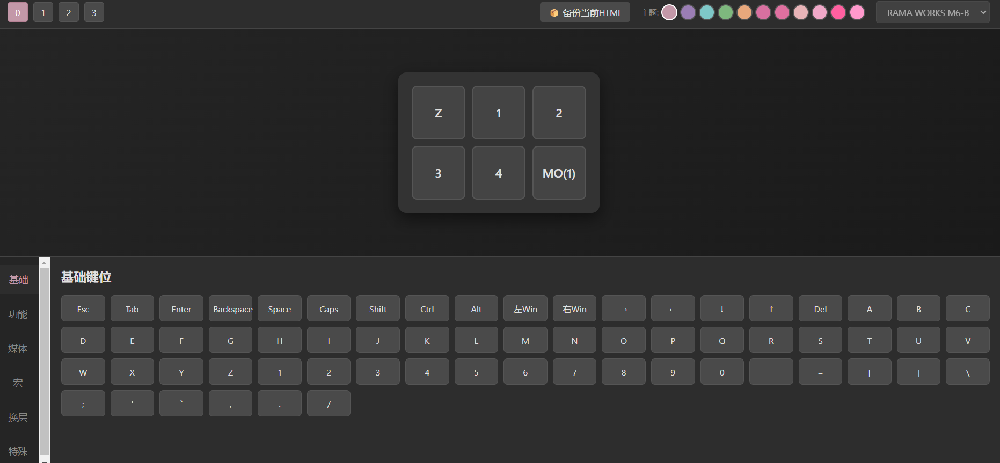
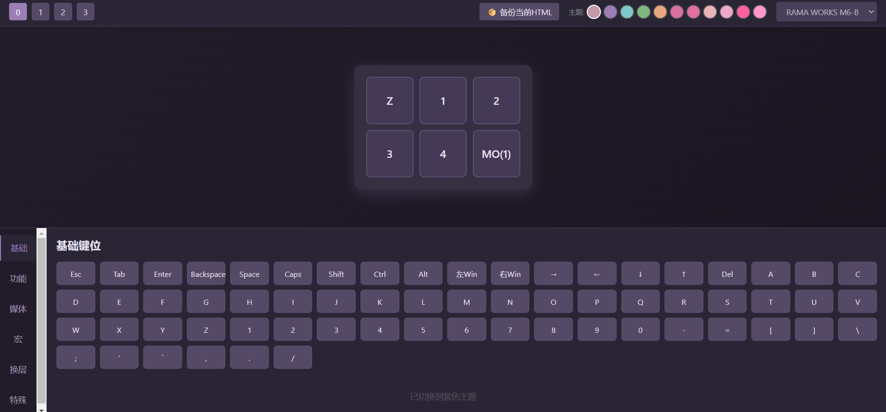
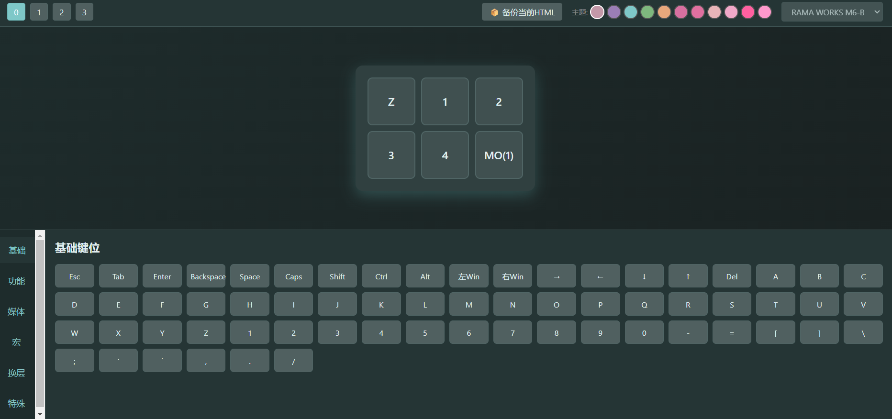
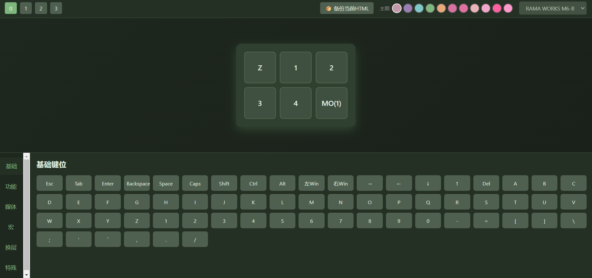
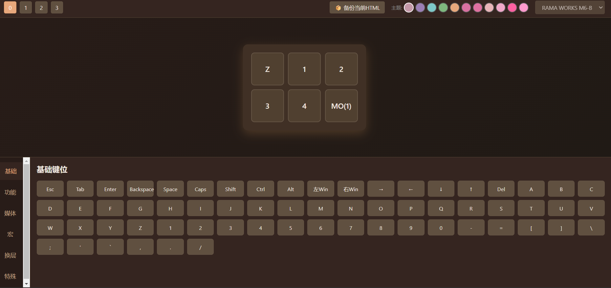
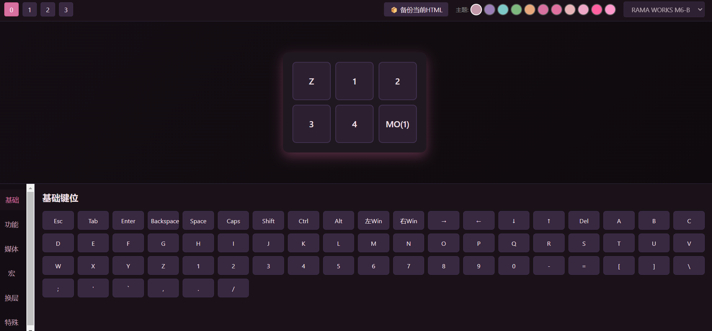
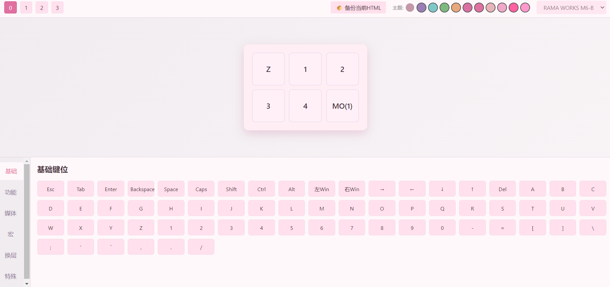
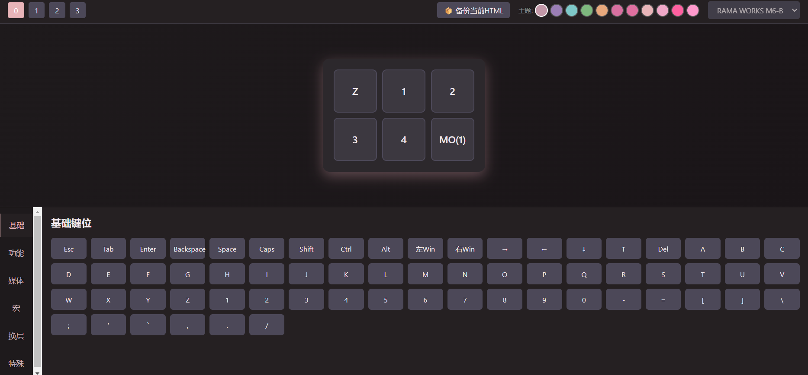
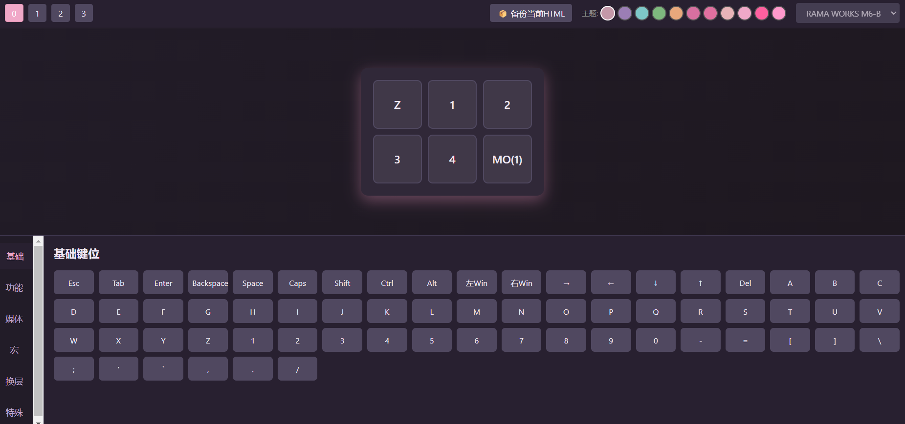
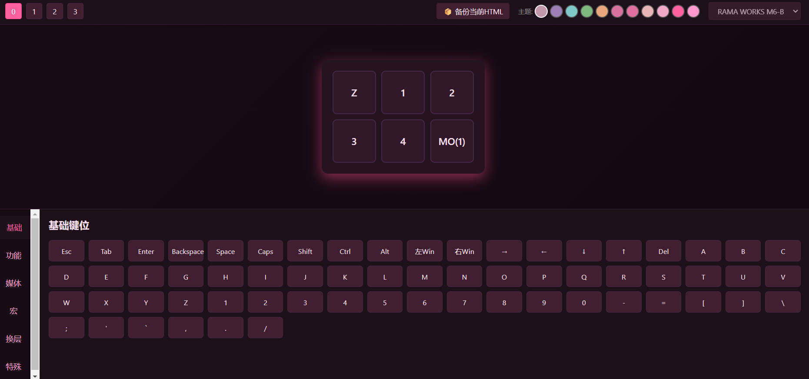
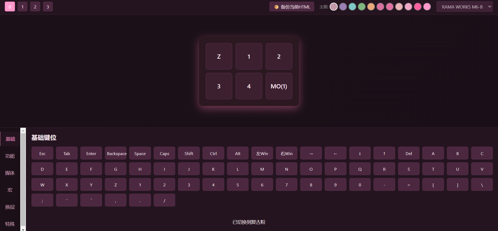
